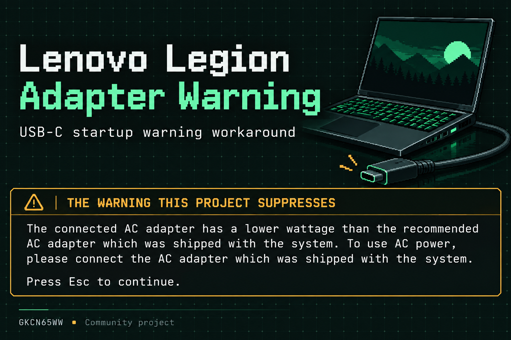
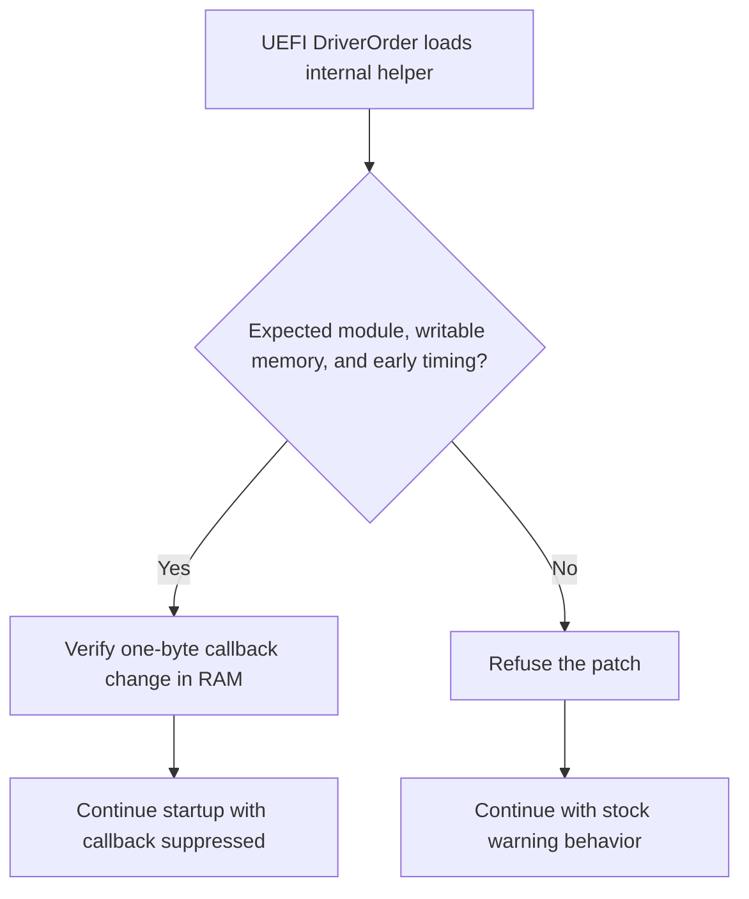

# Lenovo Legion Adapter Warning



**Version 1.0.0 · Regular release · Legion 5 Pro 16ACH6H / 82JQ · GKCN65WW only**

A small community project that gets the low-wattage USB-C adapter warning out of the way, so your Legion can start up without the interruption.

**[Download Version 1.0.0](https://github.com/aeae1/Lenovo-Legion-Adapter-Warning/releases/latest)** · [Setup guide](docs/V1-USB-WALKTHROUGH.md)

Suppresses this Lenovo startup message, including the **Press Esc to continue** interruption:

> The connected AC adapter has a lower wattage than the recommended AC adapter which was shipped with the system. To use AC power, please connect the AC adapter which was shipped with the system. Press Esc to continue.

Once installed on the internal drive, it runs quietly at startup—no thumb drive needed for everyday use. **The current release requires Secure Boot disabled; support for enabling it is in development.**

## Project credits

ChatGPT Astra did most of the work on this project, including firmware analysis, coding, test tooling, and documentation. The project owner guided the work, helped debug issues, and performed the hands-on testing on the Lenovo laptop.

## What works today

On the tested **Lenovo Legion 5 Pro 16ACH6H / 82JQ with BIOS GKCN65WW**, V4 suppressed the warning during USB-C-powered startup. Moving the helper to the internal SSD then allowed normal startup **without a thumb drive and without F12**. The owner also reported a working mouse and thumb drive. See the [reviewed hardware results](hardware-results/README.md).

The helper runs automatically before Windows and changes one byte in the loaded warning routine **in RAM each boot**. The BIOS chip stays unchanged. This does not increase USB-C wattage, change charger compatibility, or remove charging/performance limits. No simple warning-off NVRAM preference has been established.

**Secure Boot is currently disabled for the working installation.** Signing and virtual-machine enforcement tests now pass, but trust enrollment and operation with Secure Boot enabled on this Lenovo remain unverified. Follow the [signing project](signing/README.md); a self-created signature is not automatically trusted.

| Evidence | Result |
| --- | --- |
| Physical diagnostic | Intended module matched; target page already writable |
| Physical manual test | One-byte RAM change verified; no permission change needed |
| Automatic USB driver logs | Timing marker absent before patch; patch verified |
| Same USB-C setup, helper USB inserted / removed / reinserted | Warning absent / present / absent |
| Internal SSD deployment | Copy comparison and internal saved entry reviewed; normal startup without helper USB reported |
| Peripherals after internal startup | Mouse and thumb drive reported working |
| Secure Boot signing | Offline signature and OVMF admission tests pass; Lenovo enrollment still open |

These are results from one machine and firmware version. Dock behavior, other models/BIOS versions, long-term reliability, and physical internal recovery tests are not established. No full internal-run log has been supplied; the internal result is based on setup screenshots and the owner's startup report.

## Operating-system compatibility

The helper runs in UEFI before the operating system and has no Windows dependency. On the supported laptop and firmware, the warning suppression should also apply when booting Linux or another UEFI operating system, but those setups have not been physically tested. It does not select or replace your operating system's bootloader.

The current installation tools are Windows-oriented: the internal staging script checks for Windows Boot Manager to help identify the target EFI partition, and the Secure Boot inventory runs in Windows PowerShell. A Linux-only installation would need an adapted, reviewed setup procedure. Firmware compatibility and Secure Boot trust requirements still apply.

For unexpected results, see [troubleshooting and optional help](docs/TROUBLESHOOTING.md). No log submission or maintainer approval is required.

## Start here

**New to the project:** download **Lenovo-Legion-Adapter-Warning-v1.0.0.zip** from the [Version 1.0.0 release](https://github.com/aeae1/Lenovo-Legion-Adapter-Warning/releases/tag/v1.0.0), open its `START-HERE.md`, and follow the [staged USB walkthrough](docs/V1-USB-WALKTHROUGH.md). Start with the diagnostic, review its result, then progress through the manual and automatic tests. Phase 1 alone cannot establish early automatic timing.

**Already completed the successful automatic USB test:** use the `INTERNAL_SETUP` folder in the Version 1.0.0 ZIP and its `READ-ME-FIRST.md` ([current web guide](deployment/internal-1/READ-ME-FIRST.md)). The USB is used for installation and kept for recovery; it need not stay plugged in afterward. Identify your actual EFI volumes rather than assuming an FS number.

**Already running internally:** no reinstall or replacement helper is needed for this documentation/signing update. The [detailed signing walkthrough and risks](signing/WALKTHROUGH.md) begin with a Windows inventory that reads settings and saves local files. The release includes a separate small **Lenovo-Secure-Boot-Inventory-v1.0.0.zip** for this step. It does not enroll a key or change the working driver.

Use the normal Lenovo charger or a sufficiently charged battery for the initial mechanics stages. Use the USB-C setup that originally produced the warning for the actual suppression check. Keep any encryption recovery key private and available before boot-configuration changes.

## How it works



This diagram shows the ordinary success/refusal paths; detailed errors and rollback checks are in the source. The saved DriverOrder entry contains the helper's file location. The warning patch itself is temporary RAM state, recreated at each startup. Details: [firmware reassessment](docs/FIRMWARE-REASSESSMENT.md).

## Risk and removal

Avoiding a BIOS flash removes that particular flash-bricking hazard, but pre-Windows code can still hang startup. An incorrect EFI filesystem edit can also disrupt boot. No meaningful numeric risk estimate exists. The [installation guide](deployment/internal-1/READ-ME-FIRST.md#risk-in-plain-language) explains the risks and the limits of the recovery paths.

For an internal installation, removing the USB **does not disable the helper**. Follow [disable/removal instructions](deployment/internal-1/READ-ME-FIRST.md#disable-or-remove-the-internal-setup) to rename the dedicated helper or remove its exact saved driver entry. Do not delete Windows' EFI folders. BIOS updates or firmware resets may bring the original warning back.

## Research and progress

| Record | Contents |
| --- | --- |
| [Current status](docs/STATUS.md) | Observed results and remaining questions |
| [Tracking issues](planning/README.md) | Completed stages and current Secure Boot work |
| [Signing project](signing/README.md) | Offline signer, disposable-key tests, Windows inventory |
| [Secure Boot options](docs/SECURE-BOOT-OPTIONS.md) | Trust databases, actual Lenovo menu observations, unresolved enrollment |
| [Hardware reports](hardware-results/README.md) | Reviewed physical evidence and its limits |
| [V3 comparison](docs/COMPARISON-WITH-V3.md) | Earlier behavior and V4 corrections |
| [Validation](docs/VALIDATION.md) | Original host/emulator checks; separate from physical evidence |
| [Publication review](docs/PUBLICATION-REVIEW.md) | Public-data scope and firmware fixture |

## Build and check

Version 1.0.0 uses the unchanged V4 helper. Its filenames and saved driver entry retain their V4 identifiers, so existing working installations need no reinstall.

On x64 Linux with Python 3 and GCC:

```bash
python3 -m venv .venv
source .venv/bin/activate
python3 -m pip install -r requirements-build.txt
bash scripts/check.sh
```

These checks rebuild all three helpers, require byte-identical frozen V4 hashes, validate published archives, and run **33 sanitized host fault-injection cases**. The reviewed 23,360-byte firmware module is inert test data; its code is not executed by these host tests and it is excluded from the USB download. [Signing checks](signing/README.md#developer-validation) are separate and never change the released helpers.

Published release ZIPs and V4 binaries retain their original bytes and checksums. Historical text inside an older ZIP reflects its publication checkpoint; this README and [status page](docs/STATUS.md) carry current results. No complete BIOS dump, raw personal log, recovery key, or private signing key is published. See [contribution guidance](CONTRIBUTING.md), [source notes](source/README.md), and [third-party notices](THIRD-PARTY.md).
